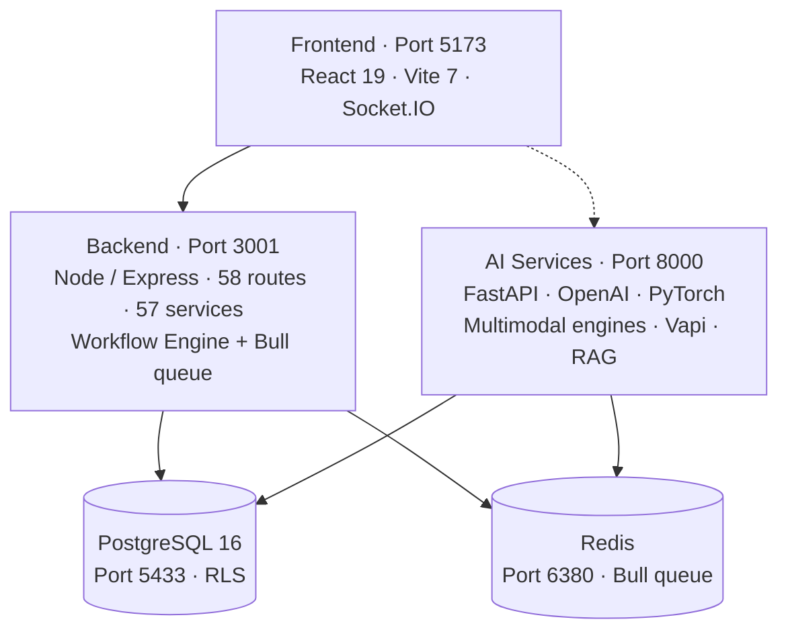

Medera is the AI infrastructure stack for behavioral and mental health, built for clinical accuracy, evidence anchoring, and enterprise compliance. Behavioral health's specialized language, validated screeners, and crisis-detection requirements demand purpose-built AI infrastructure — not a generic LLM with a prompt.

The Medera platform delivers multimodal sensing, medical-grade text generation, and agentic clinical automation through a single API that drops into existing EHR and payer workflows.

<Tip>
  The platform runs on a HIPAA-grade runtime with Row-Level Security on every tenant-scoped table, AES-256-GCM at rest for PHI, and 42 CFR Part 2 controls in the request path.
</Tip>

## Why choose Medera

|                                       |                                                                                                            |
| :------------------------------------ | :--------------------------------------------------------------------------------------------------------- |
| **Purpose-built for behavioral health** | Validated screeners, crisis detection, and 42 CFR Part 2 controls are first-class.                       |
| **Multimodal by default**             | Voice, facial physiology, and linguistic content fuse into one defensible clinical read.                   |
| **Composable agents**                 | 24 production agents and 16 + 8 canvas node types with a typed expert registry.                            |
| **Customizable and scalable**         | Sandbox-first deployments with semver versioning and WORM audit on every promotion.                        |

<Columns cols={2}>
  <Card title="Flexible infrastructure" icon="layers">
    <Icon icon="circle-check" /> Bespoke REST + WebSocket APIs  
    <Icon icon="circle-check" /> JavaScript + Python SDKs  
    <Icon icon="circle-check" /> Embeddable web components
  </Card>
  <Card title="Built for healthcare" icon="stethoscope">
    <Icon icon="circle-check" /> Behavioral-health language proficiency  
    <Icon icon="circle-check" /> Secure and compliant  
    <Icon icon="circle-check" /> Real-time or asynchronous
  </Card>
</Columns>

---

## Integrate seamlessly

Medera integrates via REST + WebSocket. The same API powers **Medera Studio** — a packaged, EHR-agnostic, real-time ambient scribe and intake agent. To embed Medera into an existing workflow or customize the interactions, dive into the API documentation below.

<CardGroup cols={2}>
  <Card title="Multimodal Sensing" icon="audio-lines" href="/multimodal/overview" horizontal>
    Voice + facial physiology + RDoC fusion.
  </Card>
  <Card title="Text Generation" icon="text-align-start" href="/textgen/overview" horizontal>
    SOAP, referral, discharge, PA letters.
  </Card>
  <Card title="Agentic Framework" icon="layers" href="/agentic/overview" horizontal>
    24 production agents + Agent Builder Canvas.
  </Card>
  <Card title="Medical Coding" icon="code" href="/coding/overview" horizontal>
    ICD-10, CPT, HCPCS, SNOMED, LOINC, RxNorm.
  </Card>
</CardGroup>

---

## Core capabilities

<CardGroup cols={3}>
  <Card title="Multimodal Sensing" icon="audio-lines" href="/multimodal/overview" horizontal>
    Real-time and asynchronous medical speech recognition, facial physiology, and vocal acoustics.
  </Card>
  <Card title="Text Generation" icon="text-align-start" href="/textgen/overview" horizontal>
    Reliable healthcare-focused LLM output, SOAP notes, and document generation.
  </Card>
  <Card title="Agentic Framework" icon="layers" href="/agentic/overview" horizontal>
    24 composable clinical agents and a canvas to build your own.
  </Card>
</CardGroup>

---

## Two-service architecture

---

## Bringing it all together

- Each component has its own tab: [Multimodal Sensing](/multimodal/overview), [Text Generation](/textgen/overview), [Agentic Framework](/agentic/overview), and [Coding](/coding/overview).
- The [API Reference](/api-reference/welcome) tab provides detailed specifications for each endpoint.
- The [Console](https://app.medera.ai) is where you create accounts and Developer API Keys.
- Quickstarts outline how to get started fast. Start with [Authentication](/authentication/overview).
- The [SDKs](/sdks/overview) section covers JavaScript, Python, web components, and Postman.
- The [Examples Repository](https://github.com/medera-ai/examples) provides working code.
- The [Release Notes](/release-notes/overview) page provides the change policy and per-product notes.

<Note>
  If you have questions about implementing Medera in your environment or product, [contact us](https://help.medera.ai).
</Note>
