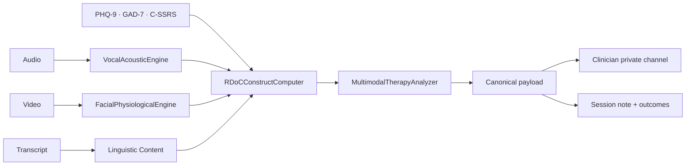

<Info>
  **Category:** Clinical Operations &nbsp;·&nbsp; **Channels:** Vocal acoustics · Facial physiology · Linguistic content · Assessments
</Info>

The Co-Therapy Agent is a silent multimodal partner — it **never** speaks to the patient. It runs the [Vocal Acoustic Engine](/multimodal/vocal/overview) and [Facial Physiological Engine](/multimodal/facial/overview), fuses outputs through the [RDoC Construct Computer](/multimodal/rdoc/overview) into 15 named construct activations, and surfaces the resulting canonical payload to the clinician on a private channel.

## Pipeline

## Endpoints

| Method | Path | Purpose |
| :--- | :--- | :--- |
| `POST` | `/api/co-therapy-sessions` | Create session (backend) |
| `POST` | `/api/co-therapy-sessions/{id}/start` | Start session + invitations |
| `POST` | `/api/co-therapy-sessions/{id}/join` | Record participant joining |
| `POST` | `/api/co-therapy-sessions/{id}/leave` | Record participant leaving |
| `POST` | `/api/co-therapy-sessions/{id}/transition` | Manually transition state |
| `POST` | `/api/multimodal-therapy/analyze-session` | Full multimodal analysis |
| `POST` | `/api/multimodal-therapy/analyze-audio-only` | Audio-only analysis |

## Configuration

| Field | Description |
| :--- | :--- |
| `audio_enabled`, `video_enabled` | Channel toggles |
| `rdoc_constructs` | Optional subset of the 15 named constructs |
| `clinical_context` | Chief complaint, active diagnoses, recent screener scores |
| `consent_recorded` | Per-session consent flag (required) |

## Composable experts

| Expert | Role |
| :--- | :--- |
| **Vocal Prosody Expert** | F0, jitter, shimmer, HNR, speaking rate, prosodic flatness |
| **Affect Dynamics Expert** | Facial affect intensity, valence, congruence |
| **Neurobehavioral Construct Expert** | RDoC activation, severity, contributors |
| **Linguistic Content Expert** | Topic, valence, certainty, pronoun shift |

## Quality gates

- **Audio**: ≥ 1.0 s, valid `voiced_fraction`
- **Video**: ≥ 30 s for HR, ≥ 60 s for HRV / BP, SNR > 3.0
- **Analyzer**: minimum 20 words of transcript + 30 s of session signal

On quality failure, the engine returns `confidence: 0.0` and the analyzer falls back to a GPT-4o transcript-inferred analysis marked `requires_human_review: true` — **never fabricated values**.

## Compliance guarantees

<Warning>
  - The Co-Therapy Agent **never** addresses or interacts with the patient.
  - Recording requires explicit per-session consent (`consent_recorded: true`).
  - Construct activations report `contributors[]` so clinicians can audit feature-level influence.
</Warning>

---

## Related

<CardGroup cols={2}>
  <Card title="Quickstart" icon="zap" href="/quickstart/co-therapy">Run a multimodal session.</Card>
  <Card title="Multimodal Overview" icon="audio-lines" href="/multimodal/overview">Engine deep dive.</Card>
  <Card title="RDoC Constructs" icon="brain" href="/multimodal/rdoc/overview">15 named constructs.</Card>
  <Card title="Multimodal API" icon="terminal" href="/api-reference/multimodal/analyze-video">REST surface.</Card>
</CardGroup>
