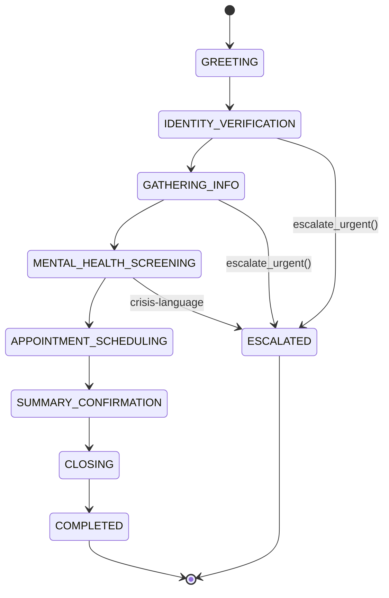

<Info>
  **Category:** Clinical Operations &nbsp;·&nbsp; **Voice agent:** Grace (`AgentType.INTAKE`) &nbsp;·&nbsp; **Voice ID:** ElevenLabs `21m00Tcm4TlvDq8ikWAM` (Rachel)
</Info>

The Patient Intake Agent runs the first contact a patient has with the practice. It is voice-first, orchestrated via Vapi with Deepgram `nova-2-medical` transcription and an ElevenLabs voice, and follows a documented 7-state conversation state machine.

## Conversation state machine

## Task types (`TaskType` enum)

`IDENTITY_VERIFICATION`, `INSURANCE_VERIFICATION`, `APPOINTMENT_SCHEDULING`, `REFERRAL_PROCESSING`, `PRE_AUTHORIZATION`, `PRESCRIPTION_REFILL`, `BILLING_CALCULATION`, `SYMPTOM_DOCUMENTATION`, `CHIEF_COMPLAINT`, `URGENT_CARE_TRIAGE`.

## Grace's 4 function calls

| Function | Signature | Purpose |
| :--- | :--- | :--- |
| `verify_identity` | `(patient_id, verification_data)` | 2-of-3 ID confirmation (DOB, address, SSN last 4) |
| `document_symptom` | `(symptom_description, severity_level, onset_date)` | Capture chief complaint |
| `flag_for_review` | `(reason, urgency_level)` | Flag for clinical review queue |
| `escalate_urgent` | `(escalation_reason, call_action)` | Hard escalation — no agent gating |

## Workflow modules

| Module | Purpose |
| :--- | :--- |
| `general_intake` | Baseline demographics + insurance + chief complaint |
| `prescription_refill` | Medication history + formulary checks |
| `lab_flagged` | Lab requisition + specimen handling |

## System prompt structure

`GRACE_SYSTEM_PROMPT_TEMPLATE` is composed of 13 sections, including:

1. **Patient context** (name, DOB, provider, conditions, meds, allergies)
2. **Call scenario** (type + scenario details)
3. **Conversation guidelines** (tone, opening, AI / recording disclosure — **mandatory**, identity verification, info gathering, sensitive topics, urgent situations, closing)

## Configuration

| Field | Description |
| :--- | :--- |
| `intake_template_id` | Practice intake template |
| `screeners` | Default `["phq-9", "gad-7", "audit-c", "c-ssrs"]` |
| `routing_matrix` | Practice routing rules by acuity and payer |
| `language` | Preferred language for the call |
| `crisis_escalation_tree_id` | Practice escalation policy |
| `workflow_modules` | `["general_intake"]` by default |

## Composable experts

| Expert | Role |
| :--- | :--- |
| **Vocal Prosody Expert** | F0, jitter, shimmer for affect and acuity inference |
| **Linguistic Content Expert** | Topic, valence, certainty, pronoun-shift markers |
| **Validated Screener Expert** | PHQ-9, GAD-7, AUDIT-C, C-SSRS administration and scoring |
| **C-SSRS Risk Expert** | Suicide-risk classification with documented rationale |

## Compliance guarantees

<Warning>
  - **Verbal recording + AI disclosure** is mandatory before any clinical questions.
  - **Identity verification** requires 2-of-3 confirmation.
  - **Crisis-language detection** bypasses agent gating and triggers `escalate_urgent` immediately.
  - **Every claim** in the summary is anchored to a quoted span in the transcript.
</Warning>

---

## Related

<CardGroup cols={2}>
  <Card title="Quickstart" icon="zap" href="/quickstart/intake-agent">Deploy Grace in 15 minutes.</Card>
  <Card title="Vapi Webhooks" icon="webhook" href="/api-reference/intake/webhooks-vapi">Webhook schema.</Card>
  <Card title="Intake API" icon="terminal" href="/api-reference/intake/create-call">REST surface.</Card>
  <Card title="Care Orchestrator" icon="grid-2x2" href="/agentic/orchestrator">Multi-agent runtime.</Card>
</CardGroup>
