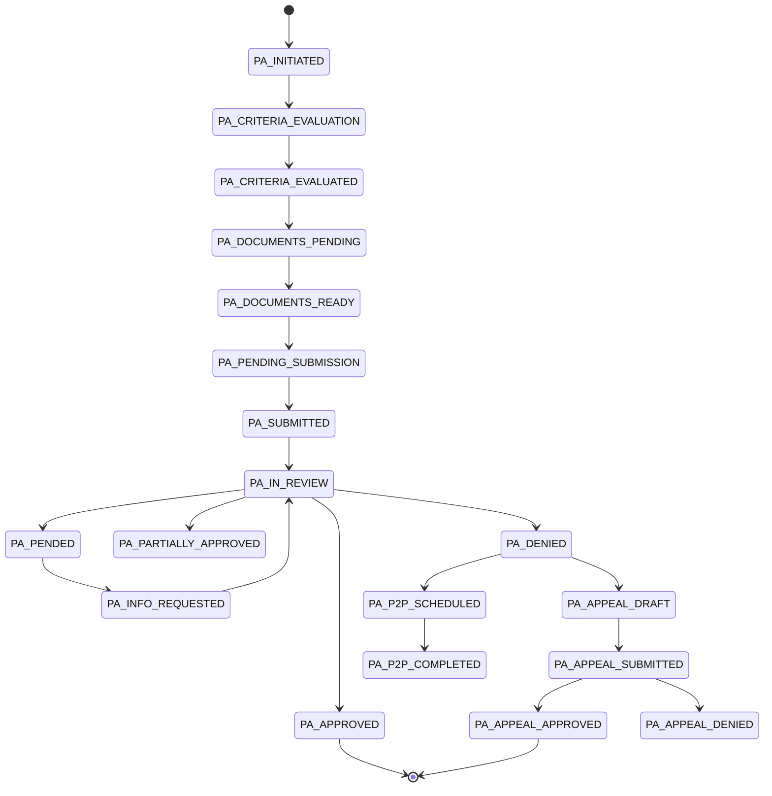
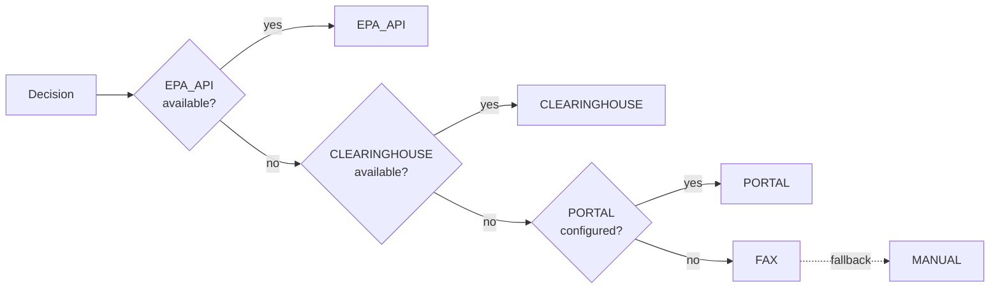

<Info>
  **Category:** Clinical Operations &nbsp;·&nbsp; **Voice agent:** Taylor (`AgentType.PA_SPECIALIST`)
</Info>

The Prior Authorization Agent drives the PA lifecycle through a 17-state workflow with payer-specific rules and multi-channel submission. Voice agent Taylor handles outbound peer-to-peer and status calls.

## Workflow states

## Payer rules

`payer_rules_repository.py` stores rules for 10 payers (`PayerId` enum):

`CARELON_ANTHEM`, `OPTUM_BH`, `MAGELLAN`, `EVERNORTH`, `UNITED_HEALTHCARE`, `AETNA`, `CIGNA`, `BLUE_CROSS`, `MEDICAID`, `MEDICARE`.

`rule_evaluator.py` returns:

| Field | Values |
| :--- | :--- |
| Recommendation | `AUTO_APPROVE`, `LIKELY_APPROVE`, `NEEDS_REVIEW`, `LIKELY_DENY` |
| Match result | `ALL_MET`, `MOSTLY_MET`, `PARTIALLY_MET`, `NOT_MET` |

## Document generators

| Document type | Producer |
| :--- | :--- |
| `MEDICAL_NECESSITY` | `narrative_service.py` |
| `CLINICAL_SUMMARY` | `narrative_service.py` |
| `TREATMENT_PLAN` | `narrative_service.py` |
| `ASSESSMENT` | `narrative_service.py` |
| `PROGRESS_NOTE` | `narrative_service.py` |
| `DISCHARGE_SUMMARY` | `narrative_service.py` |
| X-12 EDI 278 (PA request) | `x12_builder.py` |

## Submission channels

Channel priority (`submission_router.py`):

## Endpoints

| Method | Path (Backend) | Path (AI Services) |
| :--- | :--- | :--- |
| POST | `/api/prior-auth/evaluate` | `/api/pa/evaluate` |
| POST | `/api/prior-auth/evaluate/quick` | `/api/pa/evaluate/quick` |
| POST | `/api/prior-auth/requests` | `/api/pa/requests` |
| GET | `/api/prior-auth/requests/{id}` | `/api/pa/requests/{id}` |
| POST | `/api/prior-auth/requests/{id}/submit` | `/api/pa/requests/{id}/submit` |
| POST | `/api/prior-auth/requests/{id}/appeal` | `/api/pa/requests/{id}/appeal` |
| GET | `/api/prior-auth/payers` | `/api/pa/payers` |
| GET | `/api/prior-auth/payers/{id}/rules` | `/api/pa/payers/{id}/rules` |
| POST | `/api/prior-auth/documents/generate` | `/api/pa/documents/generate` |
| GET | `/api/prior-auth/channels` | `/api/pa/channels` |
| POST | `/api/prior-auth/webhooks/payer-response` | `/api/pa/webhooks/status` |
| POST | — | `/api/pa/coding-suggest` |

## Real-time coding suggestion

`realtime_coding_service.py` runs during intake to flag PA-required codes. Detected CPT: `90832`, `90834`, `90837`, `99213`, `99214`, `99215`, `96127`. Detected ICD-10: `F32.1`, `F33.1`, `F41.1`, `F43.10`, `F11.20`. Each suggestion includes `pa_required`, `pa_urgency`, `payer_policy_url`, `evidence_excerpt`.

## Composable experts

| Expert | Role |
| :--- | :--- |
| **PubMed Expert** | Peer-reviewed evidence |
| **Payer Policy Expert** | Carrier-specific rules + formulary |
| **Clinical Scoring Expert** | PHQ-9, GAD-7, validated scores |
| **Medical Coding Expert** | ICD-10 + procedure code validation |

## Compliance guarantees

<Warning>
  - Every PA letter carries explicit citations to chart and payer policy.
  - Letters are submitted only after clinician approval.
  - Payer webhooks are verified with per-payer HMAC secrets.
</Warning>

---

## Related

<CardGroup cols={2}>
  <Card title="Quickstart" icon="zap" href="/quickstart/prior-auth">Generate your first PA letter.</Card>
  <Card title="PA API" icon="terminal" href="/api-reference/pa/initiate">REST surface.</Card>
  <Card title="Denial Appeals" icon="undo" href="/agentic/agents/denial-appeals">Appeal lifecycle.</Card>
  <Card title="Eligibility" icon="badge-check" href="/agentic/agents/eligibility-verification">Pre-visit benefits.</Card>
</CardGroup>
