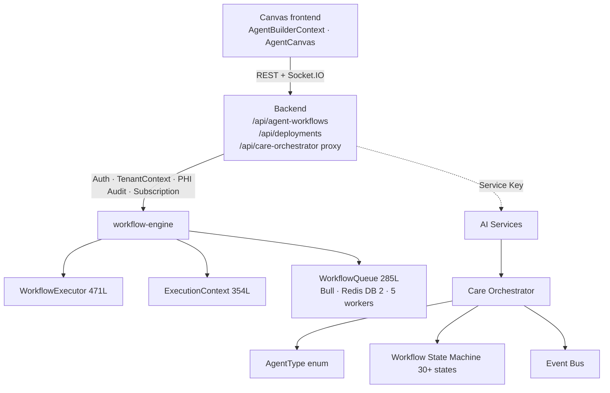
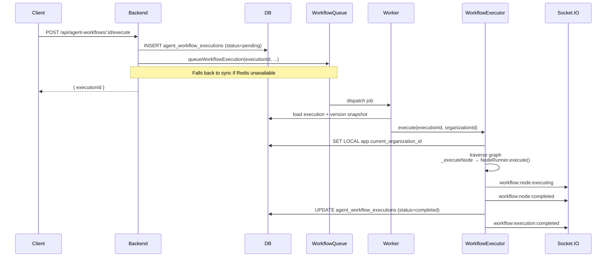

The Agentic Framework is built around two pillars: the **canvas workflow engine** (backend) and the **care orchestrator** (AI services). Both share the event bus and the tenant audit trail.



## Workflow execution



## Tenant isolation

Background workers obtain a Postgres connection and immediately run `SET LOCAL app.current_organization_id = '<org_id>'` inside a transaction. RLS policies enforce that every read and write is filtered by `organization_id`.

## Versioned execution

For published executions, the executor loads the immutable snapshot from `agent_workflow_versions`. Draft edits made to the same workflow after the publish do **not** affect running executions.

## Queue + retry

```
WorkflowQueue (Bull)
  ├─ Redis DB 2 (separate from sessions)
  ├─ retry: 3 attempts with 5 s exponential backoff
  ├─ job staleness: 60 s interval, 2 stalled threshold
  ├─ TTL: 100 completed jobs, 50 failed jobs kept
  ├─ concurrency: 5 workers
  └─ graceful sync fallback if Redis is unavailable
```

---

## What's next

<CardGroup cols={2}>
  <Card title="Core Concepts" icon="book" href="/agentic/core-concepts">Vocabulary and building blocks.</Card>
  <Card title="Orchestrator" icon="layout-grid" href="/agentic/orchestrator">Multi-agent runtime.</Card>
  <Card title="Context & Memory" icon="memory" href="/agentic/context-memory">Variable scopes and persistent memory.</Card>
  <Card title="Canvas" icon="layers" href="/agentic/canvas/overview">Build your own workflow.</Card>
</CardGroup>
