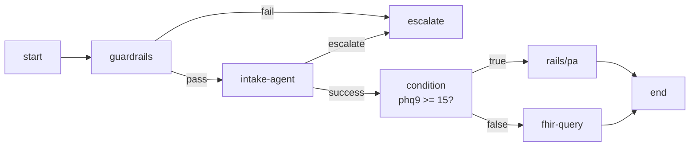

The canvas ships **16 core node types** and **8 BH-OS rail** node types. Each runner extends `BaseNodeRunner` and is registered with the `WorkflowExecutor`.

## Core nodes (3)

| Type | Runner | Purpose |
| :--- | :--- | :--- |
| `start` | `StartNodeRunner` | Workflow entry. Defines input variables. |
| `end` | `EndNodeRunner` | Workflow exit. Marks execution complete with output values. |
| `note` | annotation only | Documentation node — no runtime effect. |

## Logic & control (5)

| Type | Runner | Outputs |
| :--- | :--- | :--- |
| `condition` | `ConditionNodeRunner` | `true` / `false` (field + operator + value) |
| `transform` | `TransformNodeRunner` | `default` (Handlebars / Liquid template) |
| `classify` | `ClassifyNodeRunner` | Dynamic — one per declared category |
| `wait` | `WaitNodeRunner` | `default` (after delay or cron) |
| `user-approval` | `UserApprovalRunner` | `approved` / `rejected` — pauses execution and writes to `workflow_approvals` |

## Healthcare agents (4)

| Type | Runner | Outputs |
| :--- | :--- | :--- |
| `intake-agent` | `IntakeAgentRunner` | `success` / `escalate` / `error` |
| `scribe-agent` | `ScribeAgentRunner` | `success` / `error` |
| `therapy-agent` | `TherapyAgentRunner` | `success` / `concern` / `error` |
| `triage-agent` | `TriageAgentRunner` | `urgent` / `routine` / `self_care` |

## Integration & data (4)

| Type | Runner | Outputs |
| :--- | :--- | :--- |
| `guardrails` | `GuardrailsNodeRunner` | `pass` / `fail` |
| `ehr-sync` | `EHRSyncNode` | `success` / `error` |
| `fhir-query` | `FHIRQueryRunner` | `success` / `error` |
| `escalate` | `EscalateNodeRunner` | (terminal — sends notification) |

## BH-OS rails (8)

The BH-OS rails are typed runners backed by `StudioBlockRunner`. Each rail wires the workflow into a corresponding backend service.

<CardGroup cols={2}>
  <Card title="rails/assessment" icon="clipboard-check">Clinical assessment runner</Card>
  <Card title="rails/triage" icon="alert-triangle">Triage routing</Card>
  <Card title="rails/referral" icon="link">Referral generator + closed-loop</Card>
  <Card title="rails/pa" icon="file-check">Prior authorization workflow</Card>
  <Card title="rails/mbc" icon="chart-line">Measurement-Based Care</Card>
  <Card title="rails/quality" icon="award">HEDIS / MIPS capture</Card>
  <Card title="rails/network" icon="network">Provider network logic</Card>
  <Card title="rails/pharmacy" icon="pill">Surescripts e-Rx + DDI</Card>
</CardGroup>

## Sample composition

## Validation

`BaseNodeRunner.validate(node)` enforces required fields per node type at design time. Connections are type-checked — a `condition` node's `true` port can only connect to a node that accepts the condition's state output shape.

---

## What's next

<CardGroup cols={2}>
  <Card title="Variables & Scopes" icon="code" href="/agentic/canvas/variables-scopes">Template resolution and template syntax.</Card>
  <Card title="Versioning & Deployment" icon="rocket" href="/agentic/canvas/versioning-deployment">Snapshots, sandbox-first deploys, WORM audit.</Card>
  <Card title="Guardrails" icon="shield-check" href="/agentic/canvas/guardrails">HIPAA + 42 CFR Part 2 rules.</Card>
  <Card title="Transforms" icon="wand" href="/agentic/canvas/transforms-cel">Template-driven data shaping.</Card>
</CardGroup>
