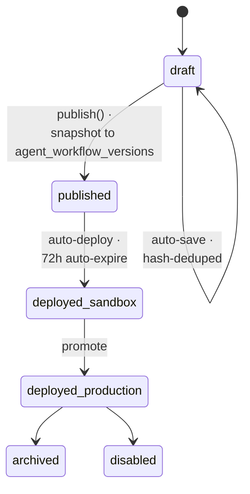

The Agent Builder Canvas is a visual workflow editor backed by a production workflow engine. It composes **16 core node types** plus **8 BH-OS rails** into clinical workflows that ship safely from sandbox to production with WORM audit.

<CardGroup cols={4}>
  <Card title="WorkflowExecutor" icon="play" horizontal>
    471 lines · graph traversal · RLS-scoped
  </Card>
  <Card title="ExecutionContext" icon="memory" horizontal>
    354 lines · 5 variable scopes
  </Card>
  <Card title="WorkflowQueue" icon="list" horizontal>
    285 lines · Bull queue · 5 workers
  </Card>
  <Card title="BaseNodeRunner" icon="puzzle" horizontal>
    15 runners + StudioBlockRunner
  </Card>
</CardGroup>

---

## Lifecycle

`agent_workflows` carries the current draft. Publishing snapshots the canvas into `agent_workflow_versions` and immediately deploys to sandbox. Promotion to production is explicit.

## Optimistic concurrency

Every draft update is guarded by `lock_version`. Concurrent edits to the same workflow return `409 idempotency_conflict`. Draft auto-save is hash-deduped — identical payloads do not create new versions.

## Tenant isolation

The canvas is tenant-scoped end to end:

- `agent_workflows.organization_id` is RLS-enforced
- Published versions inherit the org
- Deployments expose `https://sandbox.medera.info/{org}/{agent}-v{ver}` (sandbox) or `https://agents.medera.info/{org}/{agent}` (production)
- Sandbox deployments auto-expire 72 h after deploy

---

## Variable scopes

Canvas nodes can reference variables using `{{scope.path}}` syntax. Five scopes are available:

| Scope | Lifetime | Mutability | Example |
| :--- | :--- | :--- | :--- |
| `workflow.input` | Per execution | Immutable | `{{input.patient_id}}` |
| `state.<name>` | Per execution | Mutable | `{{state.phq9_score}}` |
| `nodes.<id>.output` | Per execution | Immutable | `{{nodes.intake_1.output.transcript}}` |
| `runtime.context` | Per execution | Immutable | `{{runtime.organization_id}}` |
| `tenant.secret` | Persistent | Read-only | `{{tenant.secret.epic_oauth_client_id}}` |

`tenant.secret` is sourced from your configured secret store (SSM / Vault) — secrets are never inlined into versions or deployments.

---

## Real-time events (Socket.IO)

The executor emits the following events to the org room and per-execution room:

| Event | When |
| :--- | :--- |
| `workflow:execution:started` | Execution claimed by a worker |
| `workflow:node:executing` | Node `_executeNode` invoked |
| `workflow:node:completed` | Node returned `success()` |
| `workflow:ehr-sync` | An `ehr-sync` node read or wrote to a connected EHR |
| `workflow:execution:paused` | A `user-approval` node returned `{ paused: true }` |
| `workflow:execution:completed` | Reached `end` node |
| `workflow:execution:failed` | Node threw without an error handler |

---

## What's next

<CardGroup cols={2}>
  <Card title="Node Types" icon="puzzle" href="/agentic/canvas/node-types">16 core nodes + 8 BH-OS rails.</Card>
  <Card title="Variables & Scopes" icon="code" href="/agentic/canvas/variables-scopes">Variable resolution and template syntax.</Card>
  <Card title="Versioning & Deployment" icon="rocket" href="/agentic/canvas/versioning-deployment">Sandbox-first deployment with WORM audit.</Card>
  <Card title="Guardrails" icon="shield-check" href="/agentic/canvas/guardrails">HIPAA + 42 CFR Part 2 enforcement.</Card>
</CardGroup>
