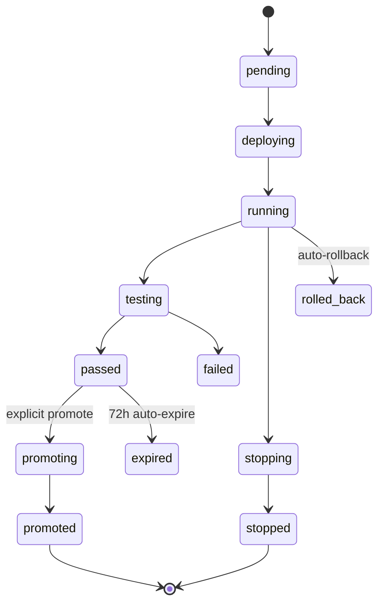

Canvas workflows are semver-versioned. Publishing creates an immutable snapshot in `agent_workflow_versions` and triggers an automatic sandbox deployment.

## Deployment lifecycle

## Tables

| Table | Migration | Purpose |
| :--- | :--- | :--- |
| `agent_workflows` | 061 / 110 / 130 | Current draft + status + `lock_version` |
| `agent_workflow_versions` | 110 | Immutable per-version snapshot |
| `agent_workflow_executions` | 110 | Per-execution trace + `trigger_type` |
| `workflow_approvals` | 111 | `user-approval` pauses |
| `workflow_schedules` | 112 / 133 | Cron triggers |
| `agent_deployments` | 138 / 151 / 152 | Runtime deployments — `environment`, status, snapshots, URLs, auto-rollback |
| `agent_links` | 141 | Shareable canonical URL per deployment |
| `agent_calls` | 142 | Per-call tracking |
| `agent_call_function_logs` | 143 | High-volume per-function-invocation log (BIGSERIAL) |
| `deployment_preview_access` | 144 | Token-based sandbox sharing |
| `deployment_audit_log` | 140 / 145 | WORM-style immutable audit |
| `deployment_metrics` | 148 | Time-bucketed metrics |
| `deployment_alerts` | 149 | Threshold-based alerting |

## URLs

- **Sandbox** — `https://sandbox.medera.info/{org_slug}/{agent_slug}-v{version}`
- **Production** — `https://agents.medera.info/{org_slug}/{agent_slug}`
- **Sandbox auto-expiry** — `auto_expire_at` set 72 h after deploy; `expirePreviewTokens` cron runs daily at 3 AM.

## Auto-rollback

`agent_deployments.auto_rollback_config` declares thresholds (error rate, p95 latency, alert severity). When triggered, the deployment rolls back to the previous successful version and writes an `event_type='rolled_back'` row to `deployment_audit_log`.

## WORM audit

`deployment_audit_log` is append-only. UPDATE and DELETE are blocked by triggers (migration 145 fixed the FK from RESTRICT → SET NULL to preserve WORM semantics when actors are deleted).

---

## What's next

<CardGroup cols={2}>
  <Card title="Node Types" icon="puzzle" href="/agentic/canvas/node-types">16 core + 8 rail nodes.</Card>
  <Card title="Variables & Scopes" icon="code" href="/agentic/canvas/variables-scopes">Template syntax.</Card>
  <Card title="Guardrails" icon="shield-check" href="/agentic/canvas/guardrails">Runtime enforcement.</Card>
  <Card title="Transforms" icon="wand" href="/agentic/canvas/transforms-cel">Data shaping.</Card>
</CardGroup>
