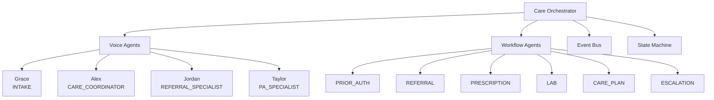

The Care Orchestrator lives in AI Services (`src/care_orchestrator/`, 27 files) and exposes a REST surface under `/api/care-orchestrator`. It coordinates voice agents, workflow agents, an event bus, and a workflow state machine.

## Agents at a glance

## Voice agents (4)

| `AgentType` | Name | Voice ID | Purpose |
| :--- | :--- | :--- | :--- |
| `INTAKE` | **Grace** | ElevenLabs `21m00Tcm4TlvDq8ikWAM` (Rachel) | Patient intake calls |
| `CARE_COORDINATOR` | **Alex** | ElevenLabs `pNInz6obpgDQGcFmaJgB` (Adam) | Ongoing care, follow-ups |
| `REFERRAL_SPECIALIST` | **Jordan** | ElevenLabs `EXAVITQu4vr4xnSDxMaL` (Bella) | Referral management |
| `PA_SPECIALIST` | **Taylor** | ElevenLabs `yoZ06aMxZJJ28mfd3POQ` (Sam) | Prior authorization |

All voice agents use Deepgram `nova-2-medical` transcription, OpenAI `gpt-4-turbo` LLM (T=0.3, max 500 tokens), and ElevenLabs `eleven_turbo_v2` synthesis. Default call settings: 15-minute max duration, 10 s silence timeout, recording enabled.

## Workflow agents (6)

`AgentType.PRIOR_AUTH`, `REFERRAL`, `PRESCRIPTION`, `LAB`, `CARE_PLAN`, `ESCALATION` — these are backend agents that drive multi-step workflows without voice.

## Endpoints

| Method | Path | Purpose |
| :--- | :--- | :--- |
| GET | `/api/care-orchestrator/health` | Health |
| GET | `/api/care-orchestrator/workflows` | List workflows (filters: org, type, status, patient) |
| POST | `/api/care-orchestrator/workflows` | Create workflow |
| GET | `/api/care-orchestrator/workflows/{id}` | Get workflow |
| POST | `/api/care-orchestrator/workflows/{id}/transition` | Trigger state transition |
| POST | `/api/care-orchestrator/workflows/{id}/cancel` | Cancel |
| GET | `/api/care-orchestrator/agents` | List agents |
| GET | `/api/care-orchestrator/agents/{agent_type}` | Get agent |
| GET | `/api/care-orchestrator/agents/{agent_type}/stats` | Agent stats |
| POST | `/api/care-orchestrator/tasks/route` | Route task to agent |
| GET | `/api/care-orchestrator/tasks` | List tasks |
| GET | `/api/care-orchestrator/voice/agents` | List voice agents |
| POST | `/api/care-orchestrator/voice/calls` | Initiate voice call |
| GET | `/api/care-orchestrator/voice/calls/{call_id}` | Call status |
| POST | `/api/care-orchestrator/voice/calls/{call_id}/transfer` | Transfer call |
| POST | `/api/care-orchestrator/voice/calls/{call_id}/end` | End call |
| GET | `/api/care-orchestrator/voice/calls/{call_id}/transcript` | Get transcript |
| GET | `/api/care-orchestrator/events` | List events |
| POST | `/api/care-orchestrator/events` | Publish event |
| GET | `/api/care-orchestrator/patients/{id}/events` | Patient events |
| GET | `/api/care-orchestrator/patients/{id}/workflows` | Patient workflows |
| GET | `/api/care-orchestrator/analytics/summary` | Analytics |

## Event bus

| Category | Sample events |
| :--- | :--- |
| **Intake** | `INTAKE_INITIATED`, `INTAKE_CALL_STARTED`, `INTAKE_IDENTITY_VERIFIED`, `INTAKE_RED_FLAG_DETECTED`, `INTAKE_BEHAVIORAL_HEALTH_DETECTED`, `INTAKE_COMPLETED` |
| **PA** | `PA_INITIATED`, `PA_CRITERIA_EVALUATED`, `PA_DOCUMENTS_GENERATED`, `PA_SUBMITTED`, `PA_APPROVED`, `PA_DENIED`, `PA_APPEAL_INITIATED`, `PA_P2P_SCHEDULED`, `PA_UNITS_EXPIRING` |
| **Referral** | `REFERRAL_INITIATED`, `REFERRAL_SPECIALTY_IDENTIFIED`, `REFERRAL_PA_REQUIRED`, `REFERRAL_SUBMITTED`, `REFERRAL_APPOINTMENT_SCHEDULED`, `REFERRAL_CLOSED` |
| **Prescription** | `PRESCRIPTION_INITIATED`, `PRESCRIPTION_INTERACTION_WARNING`, `PRESCRIPTION_PA_REQUIRED`, `PRESCRIPTION_APPROVED`, `PRESCRIPTION_DISPENSED` |
| **Lab** | `LAB_ORDER_INITIATED`, `LAB_SPECIMEN_COLLECTED`, `LAB_RESULTS_AVAILABLE`, `LAB_ABNORMAL_REVIEW`, `LAB_CRITICAL_ALERT` |

---

## What's next

<CardGroup cols={2}>
  <Card title="A2A Protocol" icon="message-square" href="/agentic/a2a-protocol">Agent-to-agent communication.</Card>
  <Card title="Context & Memory" icon="memory" href="/agentic/context-memory">Per-execution context + persistent memory.</Card>
  <Card title="Core Concepts" icon="book" href="/agentic/core-concepts">Building blocks of the framework.</Card>
  <Card title="Architecture" icon="diagram-project" href="/agentic/architecture">Runtime architecture.</Card>
</CardGroup>
