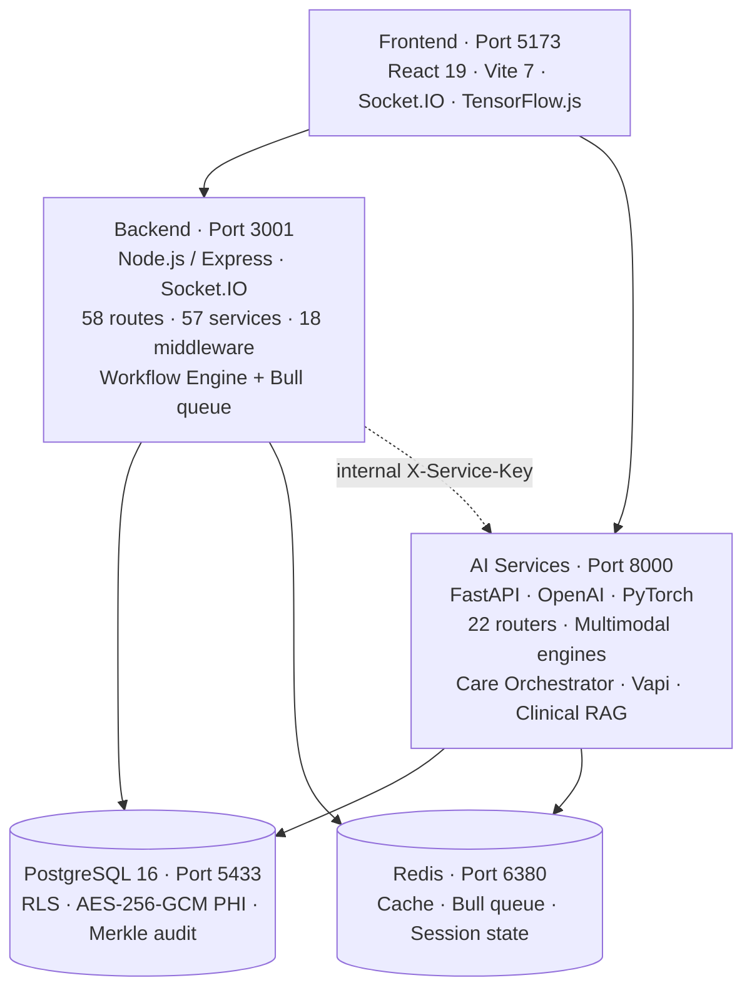

Medera is the AI infrastructure platform for behavioral and mental health. It combines a **canvas-based agent builder**, **multimodal clinical sensing** (vocal acoustics + facial physiology + RDoC constructs), purpose-built medical reasoning, and a HIPAA-grade runtime — delivered through a single REST + WebSocket API and typed JavaScript / Python SDKs.

<Tip>
  Medera is the most accurate, defensible, and clinician-ready **AI platform for behavioral and mental health teams** — without compromises on integration speed, evidence, or compliance.
</Tip>

<Card title="Buyer's Guide" href="https://medera.ai/whitepaper" arrow="true" cta="Read the whitepaper" icon="book-open">
  Learn what makes Medera the right choice for clinical and product teams building the next generation of behavioral health applications.
</Card>

---

## Why Medera

|                                       |                                                                                                                                                                                  |
| :------------------------------------ | :------------------------------------------------------------------------------------------------------------------------------------------------------------------------------- |
| **Purpose-built for behavioral health** | Validated screeners (PHQ-9, GAD-7, AUDIT-C, C-SSRS), RDoC construct mapping, and 42 CFR Part 2 controls are first-class — not bolted on.                                       |
| **Multimodal by default**             | Voice (Whisper, Deepgram nova-2-medical), facial physiology (HR, BP, HRV, RR, stress), and linguistic content fuse into one clinical signal.                                     |
| **Composable clinical agents**        | 24 production agents, 16 core canvas node types + 8 BH-OS rails, a typed expert registry, and an A2A protocol.                                                                   |
| **Evidence-anchored**                 | Every claim is anchored to a quoted span, a screener score, or a peer-reviewed citation. Confidence is calibrated, never invented.                                               |
| **Enterprise-grade runtime**          | PostgreSQL with RLS on 100+ tables, AES-256-GCM PHI columns, Merkle-tree audit, sandbox-first deployments with WORM audit, and HIPAA + 42 CFR Part 2 controls in the request path. |

<Columns cols={2}>
  <Card title="Flexible infrastructure" icon="layers">
    <Icon icon="circle-check" /> REST + WebSocket APIs  
    <Icon icon="circle-check" /> JavaScript + Python SDKs  
    <Icon icon="circle-check" /> Embeddable web components
  </Card>

  <Card title="Built for healthcare" icon="stethoscope">
    <Icon icon="circle-check" /> Behavioral-health language proficiency  
    <Icon icon="circle-check" /> HIPAA, 42 CFR Part 2, SOC 2 controls  
    <Icon icon="circle-check" /> Real-time or asynchronous
  </Card>
</Columns>

---

## Core capabilities

<CardGroup cols={2}>
  <Card title="Multimodal Sensing" icon="audio-lines" href="/multimodal/overview">
    Facial Physiological Engine (rPPG + HRV with SDNN, RMSSD, LF/HF, SD1, SD2), Vocal Acoustic Engine (F0, jitter, shimmer, HNR, MFCC, clinical markers), and the RDoC Construct Computer — 15 named constructs across 5 domains.
  </Card>
  <Card title="Text Generation" icon="text-align-start" href="/textgen/overview">
    Reliable behavioral-health-focused LLM output for SOAP notes, referral letters, discharge summaries, PA letters, and validated note lifecycle (transition, approve, finalize, track-change).
  </Card>
  <Card title="Agentic Framework" icon="layers" href="/agentic/overview">
    24 production agents, 16 core canvas node types + 8 BH-OS rails, semver versioning, sandbox-first deployment to `sandbox.medera.info`, and a typed expert registry.
  </Card>
  <Card title="Care Orchestrator" icon="grid-2x2" href="/agentic/orchestrator">
    4 voice agents (Grace, Alex, Jordan, Taylor) + 6 workflow agents (PRIOR_AUTH, REFERRAL, PRESCRIPTION, LAB, CARE_PLAN, ESCALATION), 30+ state workflow machine, event bus.
  </Card>
</CardGroup>

---

## Service topology

---

## Common workflows

<CardGroup cols={2}>
  <Card title="Build a canvas workflow" icon="layout-grid" href="/agentic/canvas/overview">
    Drag a graph of agents, tools, and logic. Publish a semver version. Deploy to sandbox. Promote to production.
  </Card>
  <Card title="Run an ambient scribe" icon="microphone" href="/quickstart/ambient-rt">
    Open the clinical session WebSocket, stream encounter audio, get diarized transcript + SOAP draft + ICD-10 / CPT suggestions.
  </Card>
  <Card title="Deploy Grace for intake" icon="phone" href="/quickstart/intake-agent">
    Deploy the voice-first intake agent with a documented 7-state state machine and 4 function calls.
  </Card>
  <Card title="Generate a PA letter" icon="file-check" href="/quickstart/prior-auth">
    Drive a 17-state PA workflow with payer-specific rules across EPA_API, CLEARINGHOUSE, PORTAL, FAX, or MANUAL submission.
  </Card>
</CardGroup>

---

## Bringing it all together

This documentation site explains how to use the Medera API and provides example workflows.

- Each component of the Medera platform has its own tab: [Multimodal Sensing](/multimodal/overview), [Text Generation](/textgen/overview), [Agentic Framework](/agentic/overview), and [Coding](/coding/overview).
- The [API Reference](/api-reference/welcome) tab provides detailed specifications for every endpoint.
- The [Console](https://app.medera.ai) is where you create an account and Developer API Keys.
- Quickstarts at the top of the Home tab outline how to get started fast. Start with [Authentication](/authentication/overview).
- The [SDKs](/sdks/overview) section covers the official [JavaScript](/sdks/js/overview) and [Python](/sdks/python/overview) SDKs, [Dictation Web Component](/sdks/dictation-component), and [Postman collection](/sdks/postman).
- The [Examples Repository](https://github.com/medera-ai/examples) provides working code for authentication, streaming, multimodal capture, and proxy setups.
- The [Release Notes](/release-notes/overview) page documents the change policy, upcoming changes, and per-product release notes.

<Note>
  Questions about implementing Medera in your healthcare environment? [Contact us](https://help.medera.ai).
</Note>
