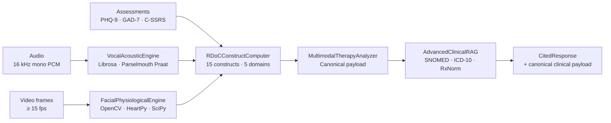

Medera Multimodal Sensing is specifically designed for behavioral and mental health. The engines below provide real-time access to clinical signal channels. Selecting the right engine depends on your use case.

<Note>
  Review the [Languages page](/about/languages) to see language support per surface and the [Architecture page](/multimodal/architecture) for engine deep dives.
</Note>

## Medera Multimodal engines

<CardGroup cols={3}>
  <Card title="Vocal Acoustic Engine" icon="waveform-lines" href="/multimodal/vocal/overview">
    F0, jitter, shimmer, HNR, MFCC, prosodic features, and clinical markers from speech.
  </Card>
  <Card title="Facial Physiological Engine" icon="eye" href="/multimodal/facial/overview">
    rPPG-derived HR, BP, HRV (SDNN, RMSSD, LF/HF, SD1, SD2), respiration, stress.
  </Card>
  <Card title="RDoC Construct Computer" icon="brain" href="/multimodal/rdoc/overview">
    15 named RDoC constructs across 5 domains fused from facial, vocal, and assessment context.
  </Card>
</CardGroup>

---

## Architecture

---

## Engine functionality

| | Vocal Acoustic | Facial Physiological | RDoC Construct |
| :--- | :--- | :--- | :--- |
| **Input** | 16 kHz mono PCM | Video frames | Vocal + Facial features + Assessments |
| **Minimum duration** | 1.0 s | 30 s (HR) / 60 s (HRV, BP) | — |
| **Library** | Librosa + Parselmouth | OpenCV + HeartPy + SciPy | NumPy + Pandas |
| **Outputs** | F0, jitter, shimmer, HNR, MFCC, clinical markers | HR, BP, HRV, RR, stress, PNS/SNS | 15 named constructs |
| **Confidence calibration** | 0–1 per family | 0–1 + SNR > 3.0 gate | `VERY_HIGH` → `VERY_LOW` |
| **Failure mode** | `unavailable` status | `confidence: 0.0` | `requires_human_review: true` |

---

## Endpoints

| Method | Path | Use |
| :--- | :--- | :--- |
| `POST` | `/api/multimodal-therapy/analyze-session` | Full multimodal analysis + biomarker persistence |
| `POST` | `/api/multimodal-therapy/analyze-audio-only` | Audio-only multimodal analysis |
| `GET` | `/api/multimodal-therapy/health` | Engine availability + dependency status |

## Confidence bands

| Band | Range | Behavior |
| :--- | :--- | :--- |
| `VERY_HIGH` | ≥ 0.95 | Auto-pass through to clinician |
| `HIGH` | ≥ 0.85 | Auto-pass through |
| `MODERATE` | ≥ 0.70 | Surfaced normally |
| `LOW` | ≥ 0.50 | `requires_human_review: true` |
| `VERY_LOW` | < 0.50 | `requires_human_review: true` + flagged for review queue |

If signal quality fails (SNR ≤ 3.0 on facial, voiced fraction too low on vocal), the engine returns `confidence: 0.0` and the analyzer falls back to a GPT-4o transcript-inferred analysis — never fabricated values.

---

## What's next

<CardGroup cols={2}>
  <Card title="Architecture" icon="diagram-project" href="/multimodal/architecture">
    Pipeline deep dive from raw signal to canonical clinical payload.
  </Card>
  <Card title="Quickstart" icon="zap" href="/multimodal/quickstart">
    Stream your first multimodal session end-to-end.
  </Card>
  <Card title="RDoC Constructs" icon="brain" href="/multimodal/rdoc/overview">
    15 named constructs across 5 domains.
  </Card>
  <Card title="Co-Therapy Agent" icon="users" href="/agentic/agents/co-therapy">
    Agent-level documentation for in-session multimodal.
  </Card>
</CardGroup>

<Note>
  Contact us if you need help selecting the right engine or have questions about configuring requests. [help.medera.ai](https://help.medera.ai)
</Note>
