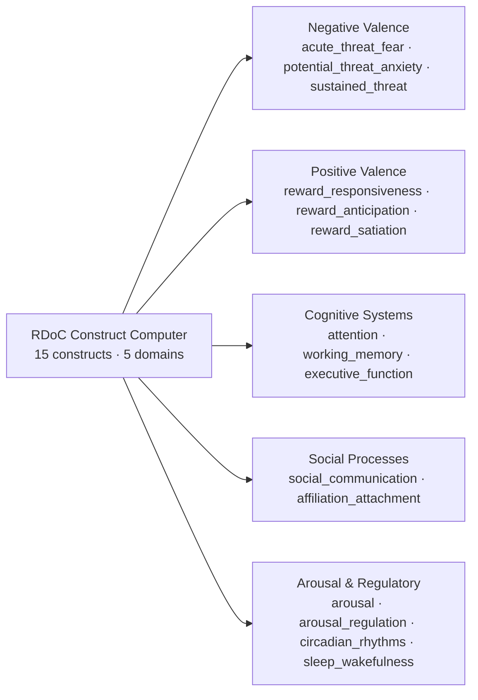

`RDoCConstructComputer.compute_all_constructs(facial_features, vocal_features, assessments, context)` returns an `RDoCActivationProfile` containing 15 `ConstructActivation` objects — one per construct — across 5 RDoC domains.

## Domain map



<CardGroup cols={2}>
  <Card title="Negative Valence" icon="cloud-rain" href="/multimodal/rdoc/negative-valence">
    `acute_threat_fear` · `potential_threat_anxiety` · `sustained_threat`
  </Card>
  <Card title="Positive Valence" icon="sun" href="/multimodal/rdoc/positive-valence">
    `reward_responsiveness` · `reward_anticipation` · `reward_satiation`
  </Card>
  <Card title="Cognitive Systems" icon="brain" href="/multimodal/rdoc/cognitive-systems">
    `attention` · `working_memory` · `executive_function`
  </Card>
  <Card title="Social Processes" icon="users" href="/multimodal/rdoc/social-processes">
    `social_communication` · `affiliation_attachment`
  </Card>
</CardGroup>

<Card title="Arousal & Regulatory Systems" icon="activity" href="/multimodal/rdoc/arousal-regulatory">
  `arousal` · `arousal_regulation` · `circadian_rhythms` · `sleep_wakefulness`
</Card>

---

## ConstructActivation

```python
@dataclass
class ConstructActivation:
    name: str                       # e.g. "potential_threat_anxiety"
    score: float                    # 0–1 activation
    confidence: float               # 0–1 calibrated
    contributors: List[Dict]        # [{feature, value, contribution}]
    interpretation: str             # clinical text
    domain: str                     # RDoC domain
    low_threshold: float = 0.3
    high_threshold: float = 0.7

    def get_severity(self) -> str:  # "low" | "moderate" | "high"
```

Severity bands:

| Score | Severity |
| :--- | :--- |
| `< 0.3` | low |
| `0.3 – 0.7` | moderate |
| `≥ 0.7` | high |

## Profile schema

```json
{
  "constructs": [
    {
      "name": "potential_threat_anxiety",
      "domain": "negative_valence",
      "score": 0.74,
      "confidence": 0.81,
      "severity": "high",
      "interpretation": "Elevated anxiety markers across vocal F0, jitter, and facial stress.",
      "contributors": [
        {"feature": "f0_mean", "value": 218.0, "contribution": 0.31},
        {"feature": "jitter", "value": 1.4, "contribution": 0.22},
        {"feature": "vocal_anxiety_index", "value": 0.66, "contribution": 0.18},
        {"feature": "stress_index", "value": 62.0, "contribution": 0.15},
        {"feature": "hrv_lf_hf_ratio", "value": 2.1, "contribution": 0.14}
      ]
    }
  ]
}
```

## Endpoint

```
POST /api/multimodal-therapy/analyze-session
```

The RDoC profile is included in the canonical payload at `payload.rdoc.constructs`.

---

## What's next

<CardGroup cols={2}>
  <Card title="Vocal Acoustic Engine" icon="waveform-lines" href="/multimodal/vocal/overview">Vocal features that drive constructs.</Card>
  <Card title="Facial Physiological Engine" icon="eye" href="/multimodal/facial/overview">Facial features that drive constructs.</Card>
  <Card title="Architecture" icon="diagram-project" href="/multimodal/architecture">Pipeline deep dive.</Card>
  <Card title="Co-Therapy Agent" icon="users" href="/agentic/agents/co-therapy">Agent-level documentation.</Card>
</CardGroup>
