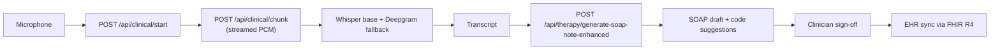

Spin up a real-time ambient scribe with the AI Services clinical endpoints — diarized capture, in-encounter SOAP drafting, ICD-10 / CPT code suggestions, and EHR sync.

## Architecture



## Prerequisites

- A Medera Console account and a Developer API Key with `write:phi` and `execute:agents` scopes.
- A microphone — see [Microphone Devices](/multimodal/stt/microphones).
- An EHR target configured under **Console → Integrations**.

<Steps>
  <Step title="Authenticate">
    Set your API key as an env variable.

    ```bash
    export MEDERA_API_KEY="<your-key>"
    ```
  </Step>

  <Step title="Start the clinical session">
    Open a clinical session — this anchors the transcript, note, and code suggestions.

    <CodeGroup>
      ```typescript JavaScript
      import { MederaClient } from '@medera/sdk';
      const client = new MederaClient({ apiKey: process.env.MEDERA_API_KEY! });

      const { session_id } = await client.clinical.start({
        session_type: 'clinical_visit',
        patient_id: 'pat_abc',
      });
      ```

      ```python Python
      from medera import MederaClient
      client = MederaClient(api_key=os.environ["MEDERA_API_KEY"])

      session = client.clinical.start(
          session_type="clinical_visit",
          patient_id="pat_abc",
      )
      ```

      ```bash cURL
      curl -X POST https://api.medera.ai/api/clinical/start \
        -H "X-API-Key: $MEDERA_API_KEY" \
        -H "Content-Type: application/json" \
        -d '{ "session_type": "clinical_visit", "patient_id": "pat_abc" }'
      ```
    </CodeGroup>
  </Step>

  <Step title="Stream chunks">
    Send PCM audio chunks (16 kHz 16-bit mono recommended) as the clinician speaks.

    <CodeGroup>
      ```typescript JavaScript
      // Encode PCM as base64
      const audio_data = btoa(String.fromCharCode(...pcmBuffer));

      const { transcript } = await client.clinical.chunk({
        session_id,
        audio_data,
      });
      ```

      ```python Python
      import base64
      audio_b64 = base64.b64encode(pcm_buffer).decode()

      res = client.clinical.chunk(
          session_id=session.id,
          audio_data=audio_b64,
      )
      ```

      ```bash cURL
      curl -X POST https://api.medera.ai/api/clinical/chunk \
        -H "X-API-Key: $MEDERA_API_KEY" \
        -d '{
          "session_id": "ses_abc",
          "audio_data": "<base64 PCM>"
        }'
      ```
    </CodeGroup>

    Local Whisper (`base`) is the default with OpenAI Whisper API as fallback. The response returns the accumulated transcript so far.
  </Step>

  <Step title="Stop the session">
    Finalize the transcript and trigger the initial clinical analysis.

    <CodeGroup>
      ```typescript JavaScript
      const result = await client.clinical.stop({ session_id });
      // result.transcription, result.clinical_data
      ```

      ```python Python
      result = client.clinical.stop(session_id=session.id)
      ```

      ```bash cURL
      curl -X POST https://api.medera.ai/api/clinical/stop \
        -H "X-API-Key: $MEDERA_API_KEY" \
        -d '{ "session_id": "ses_abc" }'
      ```
    </CodeGroup>
  </Step>

  <Step title="Generate the SOAP note">
    Use the enhanced generator for specialty templates and inline code suggestions.

    <CodeGroup>
      ```typescript JavaScript
      const note = await client.therapy.generateSoapNoteEnhanced({
        session_data: { session_id },
        specialty: 'psychiatry',
        template_config: {
          format_version: 'v3',
          include_assessments: true,
          include_billing_codes: true,
        },
      });
      ```

      ```python Python
      note = client.therapy.generate_soap_note_enhanced(
          session_data={"session_id": session.id},
          specialty="psychiatry",
          template_config={
              "format_version": "v3",
              "include_assessments": True,
              "include_billing_codes": True,
          },
      )
      ```

      ```bash cURL
      curl -X POST https://api.medera.ai/api/therapy/generate-soap-note-enhanced \
        -H "X-API-Key: $MEDERA_API_KEY" \
        -d '{
          "session_data": { "session_id": "ses_abc" },
          "specialty": "psychiatry",
          "template_config": { "include_billing_codes": true }
        }'
      ```
    </CodeGroup>

    The response includes the structured SOAP plus a list of suggested ICD-10 / CPT codes anchored to transcript spans.
  </Step>

  <Step title="Sign and post to the EHR">
    After clinician sign-off, finalize the note. Medera posts the signed note and code set to the configured EHR target via the integration adapter.

    ```bash
    curl -X POST https://api.medera.ai/api/therapy/notes/{note_id}/finalize \
      -H "X-API-Key: $MEDERA_API_KEY"
    ```
  </Step>
</Steps>

## Best practices

- Capture audio at **16 kHz 16-bit PCM mono**. Higher rates work but waste bandwidth.
- Use a dedicated lavalier or beamforming mic. See [Microphone Devices](/multimodal/stt/microphones).
- Always require clinician sign-off before posting. Never auto-post to the EHR.
- Use the transcript span IDs to render the documentation anchor next to every code suggestion.

---

## What's next

<CardGroup cols={2}>
  <Card title="Visit Scribe Agent" icon="stethoscope" href="/agentic/agents/visit-scribe">Agent-level documentation.</Card>
  <Card title="Encounter Coding" icon="code" href="/coding/encounter-coding">How code suggestions work.</Card>
  <Card title="EHR Integrations" icon="link" href="/api-reference/integrations/overview">Connect Epic, Cerner, athenahealth.</Card>
  <Card title="STT — best practices" icon="microphone" href="/multimodal/stt/best-practices-recording">Audio quality recommendations.</Card>
</CardGroup>
