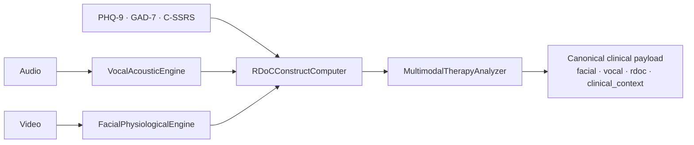

The Co-Therapy Agent is a silent multimodal partner — it never speaks to the patient. It runs the Vocal Acoustic Engine, the Facial Physiological Engine, and the RDoC Construct Computer to produce a canonical clinical payload with 15 named construct activations.

## Pipeline



<Steps>
  <Step title="Create the session">
    <CodeGroup>
      ```bash cURL
      curl -X POST https://api.medera.ai/api/co-therapy-sessions \
        -H "X-API-Key: $MEDERA_API_KEY" \
        -d '{
          "patientId": "pat_abc",
          "providers": ["prv_xyz"],
          "scheduledStart": "2026-05-28T15:00:00Z",
          "scheduledDurationMinutes": 50,
          "videoPlatform": "telehealth",
          "recordingEnabled": true,
          "deploymentId": "dep_abc"
        }'
      ```

      ```typescript JavaScript
      const session = await client.coTherapy.create({
        patientId: 'pat_abc',
        providers: ['prv_xyz'],
        scheduledStart: '2026-05-28T15:00:00Z',
        scheduledDurationMinutes: 50,
        videoPlatform: 'telehealth',
        recordingEnabled: true,
        deploymentId: 'dep_abc',
      });
      ```

      ```python Python
      session = client.co_therapy.create(
          patient_id="pat_abc",
          providers=["prv_xyz"],
          scheduled_start="2026-05-28T15:00:00Z",
          scheduled_duration_minutes=50,
          video_platform="telehealth",
          recording_enabled=True,
          deployment_id="dep_abc",
      )
      ```
    </CodeGroup>
  </Step>

  <Step title="Start the session">
    ```bash
    curl -X POST https://api.medera.ai/api/co-therapy-sessions/{id}/start \
      -H "X-API-Key: $MEDERA_API_KEY"
    ```
  </Step>

  <Step title="Analyze the session">
    Upload audio + video for full multimodal analysis. The analyzer runs the engines, computes the RDoC profile, and (optionally) retrieves clinical RAG evidence.

    <CodeGroup>
      ```bash cURL
      curl -X POST https://api.medera.ai/api/multimodal-therapy/analyze-session \
        -H "X-API-Key: $MEDERA_API_KEY" \
        -F "session_id={id}" \
        -F "audio_file=@session.wav" \
        -F "video_file=@session.mp4" \
        -F "transcript=The patient reports..." \
        -F "duration_seconds=2400" \
        -F "patient_id=pat_abc"
      ```

      ```typescript JavaScript
      const form = new FormData();
      form.append('session_id', session.id);
      form.append('audio_file', audioBlob, 'session.wav');
      form.append('video_file', videoBlob, 'session.mp4');
      form.append('transcript', transcript);
      form.append('duration_seconds', '2400');
      form.append('patient_id', 'pat_abc');

      const res = await fetch('https://api.medera.ai/api/multimodal-therapy/analyze-session', {
        method: 'POST',
        headers: { 'X-API-Key': process.env.MEDERA_API_KEY! },
        body: form,
      });
      ```

      ```python Python
      with open('session.wav', 'rb') as a, open('session.mp4', 'rb') as v:
          res = client.multimodal.analyze_session(
              session_id=session.id,
              audio_file=a,
              video_file=v,
              transcript=transcript,
              duration_seconds=2400,
              patient_id="pat_abc",
          )
      ```
    </CodeGroup>
  </Step>

  <Step title="Read the canonical payload">
    The response is a canonical payload with flat `ClinicalMetric` envelopes:

    ```json
    {
      "facial": {
        "heart_rate": { "value": 78, "unit": "bpm", "confidence": 0.91 },
        "hrv_sdnn": { "value": 42, "unit": "ms", "confidence": 0.83 },
        "stress_index": { "value": 62, "unit": "0-100", "confidence": 0.78 }
      },
      "vocal": {
        "f0_mean": { "value": 168, "unit": "Hz", "confidence": 0.92 },
        "jitter": { "value": 0.85, "unit": "%", "confidence": 0.88 },
        "prosodic_flatness": { "value": 0.48, "unit": "0-1", "confidence": 0.79 }
      },
      "rdoc": {
        "constructs": [
          {
            "name": "potential_threat_anxiety",
            "domain": "negative_valence",
            "score": 0.74,
            "confidence": "HIGH",
            "severity": "high",
            "interpretation": "Elevated anxiety markers...",
            "contributors": [
              { "feature": "f0_mean", "value": 168, "contribution": 0.31 }
            ]
          }
        ]
      },
      "clinical_context": {
        "summary": "...",
        "evidence_blocks": [...],
        "differentials": [...]
      }
    }
    ```
  </Step>
</Steps>

<Warning>
  The Co-Therapy Agent **never** addresses or interacts with the patient. Recording requires explicit per-session consent (`consent_recorded: true`).
</Warning>

---

## What's next

<CardGroup cols={2}>
  <Card title="Co-Therapy Agent" icon="users" href="/agentic/agents/co-therapy">Agent-level documentation.</Card>
  <Card title="Multimodal architecture" icon="diagram-project" href="/multimodal/architecture">Pipeline deep dive.</Card>
  <Card title="RDoC Constructs" icon="brain" href="/multimodal/rdoc/overview">15 named constructs.</Card>
  <Card title="Multimodal API" icon="terminal" href="/api-reference/multimodal/analyze-video">REST surface.</Card>
</CardGroup>
