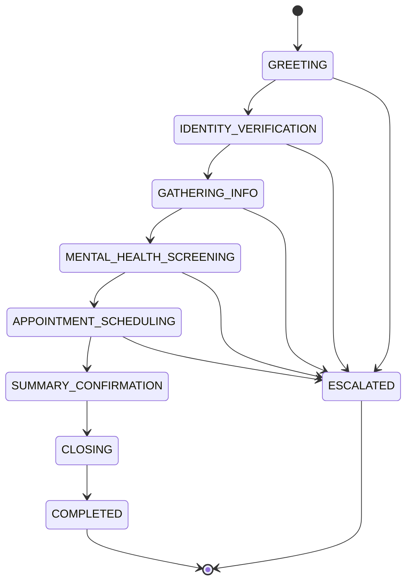

Grace is the Medera Patient Intake Agent — voice-first, adaptive, orchestrated via Vapi with Deepgram `nova-2-medical` transcription and an ElevenLabs voice. She follows a documented 7-state conversation state machine and registers 4 function calls.

## Conversation state machine



<Steps>
  <Step title="Configure the deployment">
    Use the [Agent Builder Canvas](/agentic/canvas/overview) to clone the **Grace — Patient Intake Agent** template. Configure:

    | Field | Default |
    | :--- | :--- |
    | `intake_template_id` | Practice intake template |
    | `screeners` | `["phq-9", "gad-7", "audit-c", "c-ssrs"]` |
    | `routing_matrix` | Practice routing rules by acuity and payer |
    | `crisis_escalation_tree_id` | On-call escalation tree |
    | `workflow_modules` | `["general_intake"]` |
    | `language` | `en-US` |

    Publish the workflow — the canvas auto-deploys to sandbox at `https://sandbox.medera.info/{org}/intake-v{ver}`.
  </Step>

  <Step title="Initialize the agent for the organization">
    <CodeGroup>
      ```bash cURL
      curl -X POST https://api.medera.ai/api/onboarding/initialize-organization \
        -H "X-API-Key: $MEDERA_API_KEY" \
        -d '{
          "org_name": "Acme Clinic",
          "org_type": "behavioral_health",
          "initial_agents": ["intake"],
          "voice_settings": { "language": "en-US", "tone": "warm" }
        }'
      ```

      ```typescript JavaScript
      await client.onboarding.initializeOrganization({
        org_name: 'Acme Clinic',
        org_type: 'behavioral_health',
        initial_agents: ['intake'],
        voice_settings: { language: 'en-US', tone: 'warm' },
      });
      ```

      ```python Python
      client.onboarding.initialize_organization(
          org_name="Acme Clinic",
          org_type="behavioral_health",
          initial_agents=["intake"],
          voice_settings={"language": "en-US", "tone": "warm"},
      )
      ```
    </CodeGroup>
  </Step>

  <Step title="Start an intake call">
    <CodeGroup>
      ```bash cURL
      curl -X POST https://api.medera.ai/api/intake-calls \
        -H "X-API-Key: $MEDERA_API_KEY" \
        -d '{
          "patient_id": "pat_abc",
          "phone_number": "+15555550100",
          "deployment_id": "dep_abc"
        }'
      ```

      ```typescript JavaScript
      const call = await client.intake.createCall({
        patient_id: 'pat_abc',
        phone_number: '+15555550100',
        deployment_id: 'dep_abc',
      });
      ```

      ```python Python
      call = client.intake.create_call(
          patient_id="pat_abc",
          phone_number="+15555550100",
          deployment_id="dep_abc",
      )
      ```
    </CodeGroup>
  </Step>

  <Step title="Subscribe to real-time updates">
    ```typescript
    const ws = new WebSocket(
      `wss://api.medera.ai/ws/call/${call.id}?token=${apiKey}`,
    );

    ws.addEventListener('message', (e) => {
      const event = JSON.parse(e.data);
      // event.type:
      //   'call-started' | 'utterance-processed'
      //   'task-extracted' | 'transcript-update' | 'call-ended'
    });
    ```
  </Step>

  <Step title="Receive outbound webhooks">
    If your tenant has a webhook URL configured, you'll receive signed events:

    ```http
    POST <your_webhook_url>
    Medera-Signature: sha256=<hmac>
    Medera-Event: intake.summary.ready
    Content-Type: application/json

    {
      "event": "intake.summary.ready",
      "call_id": "call_abc",
      "summary": {
        "screeners": { "phq-9": { "total": 14, "severity": "moderate" } },
        "icd10_candidates": ["F32.1"]
      }
    }
    ```

    See [Vapi webhooks](/api-reference/intake/webhooks-vapi).
  </Step>
</Steps>

## Grace's 4 function calls

| Function | Parameters | Purpose |
| :--- | :--- | :--- |
| `verify_identity` | `patient_id`, `verification_data` | 2-of-3 ID confirmation (DOB, address, SSN last 4) |
| `document_symptom` | `symptom_description`, `severity_level`, `onset_date` | Capture chief complaint |
| `flag_for_review` | `reason`, `urgency_level` | Flag for clinical review queue |
| `escalate_urgent` | `escalation_reason`, `call_action` | Hard escalation for emergencies (no agent gating) |

## Compliance guarantees

<Warning>
  Verbal recording + AI disclosure is **mandatory** before any clinical questions. Identity verification requires **2-of-3 confirmation**. Crisis-language detection **bypasses agent gating** and triggers `escalate_urgent` immediately.
</Warning>

---

## What's next

<CardGroup cols={2}>
  <Card title="Patient Intake Agent" icon="phone" href="/agentic/agents/patient-intake">Agent-level documentation.</Card>
  <Card title="Vapi Webhooks" icon="webhook" href="/api-reference/intake/webhooks-vapi">Webhook event schema.</Card>
  <Card title="Intake API" icon="terminal" href="/api-reference/intake/create-call">REST surface.</Card>
  <Card title="Crisis Response Agent" icon="shield-alert" href="/agentic/agents/crisis-response">Crisis-language detection.</Card>
</CardGroup>
