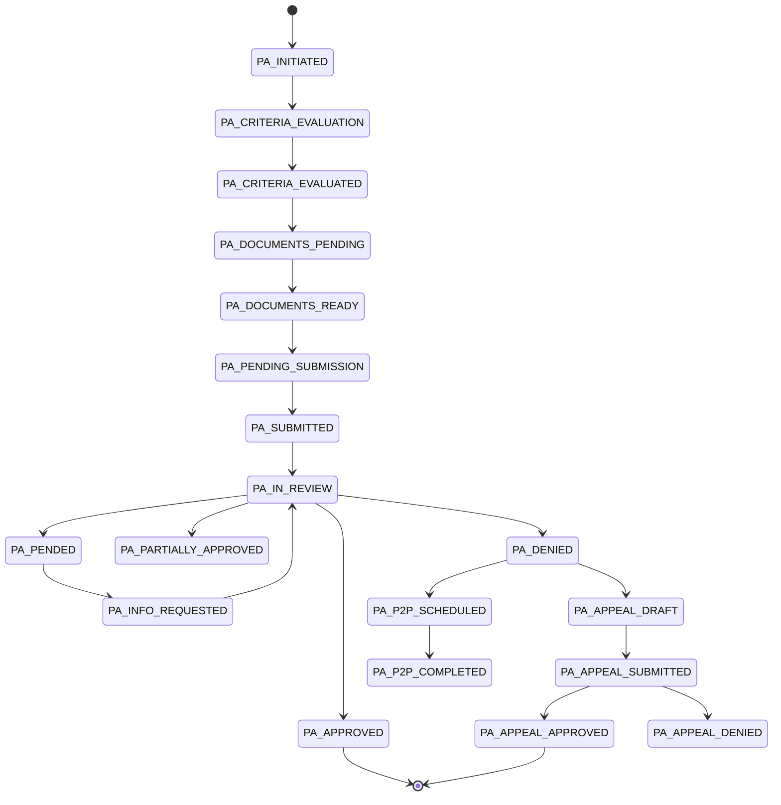

The PA workflow runs through 17 documented states with payer-specific rules and 5-channel submission. Voice agent Taylor handles outbound peer-to-peer calls.

## State machine



<Steps>
  <Step title="Evaluate criteria">
    <CodeGroup>
      ```bash cURL
      curl -X POST https://api.medera.ai/api/prior-auth/evaluate \
        -H "X-API-Key: $MEDERA_API_KEY" \
        -d '{
          "patient_data": { "diagnosis_codes": ["F32.1"], "phq9_score": 14 },
          "procedure_codes": ["90834"],
          "payer_id": "AETNA"
        }'
      ```

      ```typescript JavaScript
      const result = await client.pa.evaluate({
        patient_data: { diagnosis_codes: ['F32.1'], phq9_score: 14 },
        procedure_codes: ['90834'],
        payer_id: 'AETNA',
      });
      // result.recommendation: AUTO_APPROVE | LIKELY_APPROVE | NEEDS_REVIEW | LIKELY_DENY
      ```

      ```python Python
      result = client.pa.evaluate(
          patient_data={"diagnosis_codes": ["F32.1"], "phq9_score": 14},
          procedure_codes=["90834"],
          payer_id="AETNA",
      )
      ```
    </CodeGroup>
  </Step>

  <Step title="Create the PA request">
    <CodeGroup>
      ```bash cURL
      curl -X POST https://api.medera.ai/api/prior-auth/requests \
        -H "X-API-Key: $MEDERA_API_KEY" \
        -d '{
          "patient_id": "pat_abc",
          "diagnosis_codes": ["F32.1"],
          "procedure_codes": ["90834"],
          "clinical_justification": "...",
          "payer_id": "AETNA"
        }'
      ```

      ```typescript JavaScript
      const req = await client.pa.createRequest({
        patient_id: 'pat_abc',
        diagnosis_codes: ['F32.1'],
        procedure_codes: ['90834'],
        clinical_justification: '...',
        payer_id: 'AETNA',
      });
      ```

      ```python Python
      req = client.pa.create_request(
          patient_id="pat_abc",
          diagnosis_codes=["F32.1"],
          procedure_codes=["90834"],
          clinical_justification="...",
          payer_id="AETNA",
      )
      ```
    </CodeGroup>

    Initial state: `PA_INITIATED`.
  </Step>

  <Step title="Generate documents">
    <CodeGroup>
      ```bash cURL
      curl -X POST https://api.medera.ai/api/prior-auth/documents/generate \
        -H "X-API-Key: $MEDERA_API_KEY" \
        -d '{
          "request_id": "pa_abc",
          "document_types": ["MEDICAL_NECESSITY", "CLINICAL_SUMMARY"]
        }'
      ```

      ```typescript JavaScript
      await client.pa.generateDocuments({
        request_id: req.pa_id,
        document_types: ['MEDICAL_NECESSITY', 'CLINICAL_SUMMARY'],
      });
      ```
    </CodeGroup>
  </Step>

  <Step title="Submit">
    Submission selects the highest-priority available channel:

    ```
    EPA_API → CLEARINGHOUSE → PORTAL → FAX → MANUAL
    ```

    ```bash
    curl -X POST https://api.medera.ai/api/prior-auth/requests/{id}/submit \
      -H "X-API-Key: $MEDERA_API_KEY"
    ```
  </Step>

  <Step title="Track and appeal">
    Poll status; if denied, generate the appeal with new evidence.

    ```bash
    curl https://api.medera.ai/api/prior-auth/requests/{id} \
      -H "X-API-Key: $MEDERA_API_KEY"

    # If denied:
    curl -X POST https://api.medera.ai/api/prior-auth/requests/{id}/appeal \
      -H "X-API-Key: $MEDERA_API_KEY"
    ```
  </Step>
</Steps>

## Supported payers

`CARELON_ANTHEM`, `OPTUM_BH`, `MAGELLAN`, `EVERNORTH`, `UNITED_HEALTHCARE`, `AETNA`, `CIGNA`, `BLUE_CROSS`, `MEDICAID`, `MEDICARE`.

## Document types

`MEDICAL_NECESSITY`, `CLINICAL_SUMMARY`, `TREATMENT_PLAN`, `ASSESSMENT`, `PROGRESS_NOTE`, `DISCHARGE_SUMMARY` — plus X-12 EDI 278 for clearinghouse submission.

---

## What's next

<CardGroup cols={2}>
  <Card title="Prior Authorization Agent" icon="file-check" href="/agentic/agents/prior-authorization">Agent-level documentation.</Card>
  <Card title="PA API" icon="terminal" href="/api-reference/pa/initiate">Full REST surface.</Card>
  <Card title="Denial Appeals" icon="undo" href="/agentic/agents/denial-appeals">Appeal lifecycle.</Card>
  <Card title="Eligibility" icon="badge-check" href="/agentic/agents/eligibility-verification">Pre-visit benefits.</Card>
</CardGroup>
